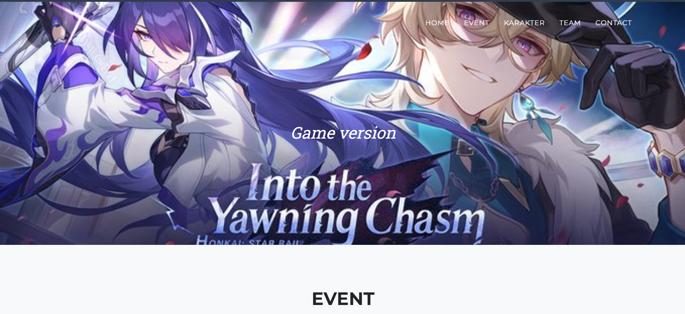
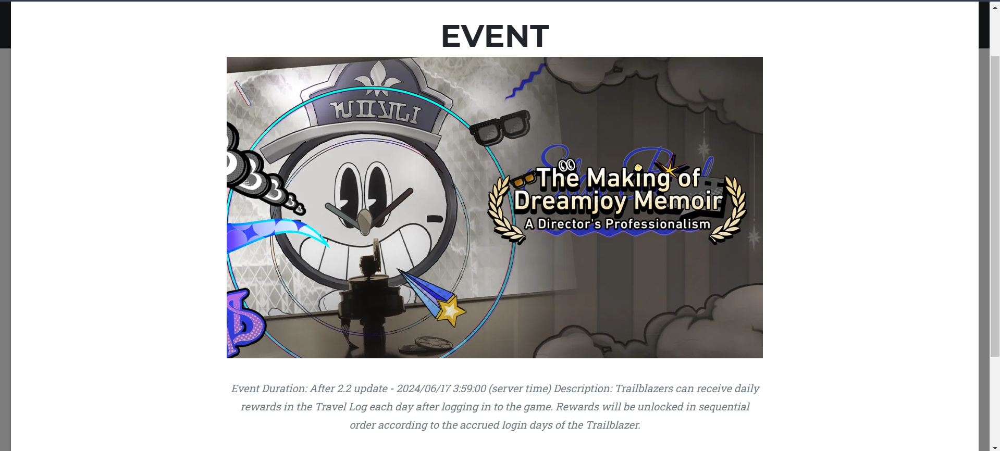
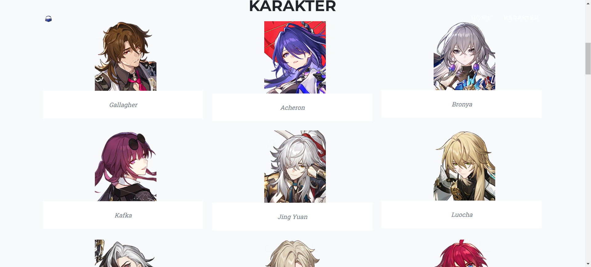
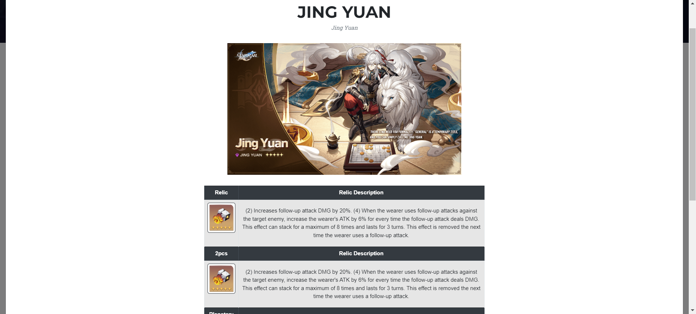

🌠 Honkai: Star Rail Game Guide
A comprehensive, full-stack web application built to help Trailblazers optimize their characters and keep track of the latest cosmic events in Honkai: Star Rail.

🚀 Key Features
Character Database: View detailed descriptions and stats for every character.

Best Equipment Guides: Strategic recommendations for Light Cones and Relics to maximize performance.

Event Schedule: A real-time tracking system for current and upcoming in-game events.

Dynamic Image Rendering: All character and equipment icons are pulled dynamically.

Custom Admin Dashboard (Backend): A powerful control panel that allows me to:

Update character descriptions and equipment stats.

Swap out character and equipment images instantly.

Create, edit, and delete event descriptions and banners.

🛠 Tech Stack
Backend: Laravel (PHP)

Frontend: Blade Templates, CSS/Tailwind

Database: MySQL (Storing character stats, equipment data, and event schedules)

Admin Panel: Built using [Laravel's core functionality] to manage the database content without touching the code.

📸 Screenshots

